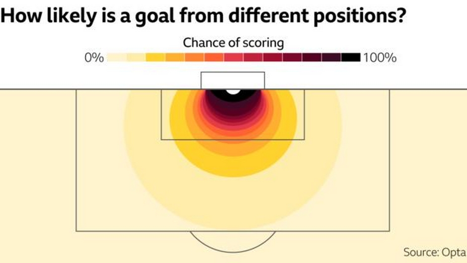

```{r setup, include=FALSE}
knitr::opts_chunk$set(echo = TRUE)
```

# Nuevos datos, nuevos análisis

Estamos viviendo una revolución de los datos en el fútbol, no hay duda. Hoy en día se generan más de 8 millones de datos por partido, y este número irá creciendo y en unos años nos parecerá muy poco en comparación. Hay 2 tipos de datos que lideran esta revolución:

* **Event data:** Datos de todos los eventos que suceden durante un partido con ultra detalle.
* **Tracking data:** Datos de la ubicación de los jugadores durante todo el partido.

Estos datos dieron lugar a una enorme cantidad métricas que habilitaron nuevas de formas de ver y analizar el juego más allá de las estadísticas tradicionales.

* _Expected Goals (xG)_
* _Expected Threats (xT)_ 
* _Expected Assists (xA)_ 
* _Possession Value (PV)_
* _Valuing Actions by Estimating Probabilities (VAEP)_ 
* etc.

En esta ocasión vamos a profundizar en una de las más famosas, Expected Goals (xG).

# Expected Goals (xG)

Muchas veces al analizar el rendimiento de un equipo o un jugador vemos la cantidad de disparos u oportunidades de gol para ver si "mereció ganar" o no, o si fue eficaz o no.
Pero los remates no valen todos lo mismo. La probabilidad de hacer un gol no es la misma rematando a 2 metros del arco que a 25. Incluso estando a escasos metros no es lo mismo que el rematador sea un delantero con sun pierna hábil, que un defensor con su pierna menos hábil. Por eso prestarle atención solamente a las oportunidades de gol puede ser muy engañoso y pocos nos dice de la calidad de las mismas o cuán "reales" fueron esas chances de marcar.

A partir de los datos de eventos que se generan en los partidos surgió una nueva métrica que permite ver con mayor detalle las oportunidades de gol generadas por los equipos. Expected Goals (xG) es un indicador estadístico que asigna una probabilidad de que una ocasión sea gol en función de las características de la jugada (ángulo del remate, distancia al arco, parte del cuerpo con que se remató, cantidad de jugadores delante, etc.). Esta probabilidad va entre 0 y 1, y prácticamente es una medida de calidad de los ataques.

<center>

</center>


Si un equipo o jugador tiene xG altos, significará que genera situaciones muy favorables para hacer gol. Así si un equipo o jugador marca más goles que los xG será algo positivo, rindió mejor de los esperado, mientras que si sucede lo contrario indica que tiene un rendimiento menos al esperado. Esta métrica va más allá de la cantidad! Un equipo puede generar muchas chances pero con xG bajos, esto indicará situaciones de mala calidad.

# Rendimiento individual

Para esta ocasión vamos a analizar el rendimiento de los jugadores de la Superliga Argentina durante los últimos 3 años usando la métrica xG para ver qué jugadores rindieron por sobre lo esperado y quiénes no. El dataframe que usamos tiene métricas de los jugadores para todos los partidos que jugaron por el torneo local. Así cada fila corresponde a las métricas de un jugador específico para determinado partido.

Como siempre, cargamos las librerías que usaremos, en este caso la ya conocida **tidyverse**, y
cargamos los datos!

```{r, echo=TRUE, message=FALSE}
library(tidyverse)

df <- read.csv("../data/jugadores_superliga.csv",encoding = 'UTF-8')
```


Como siempre, lo primero que hacemos es familiarizarnos con los datos que usaremos con una exploración básica.

```{r, echo=TRUE, message=FALSE}
str(df)
summary(df)
```

Nuestro df tiene 53.325 observaciones y 76 variables, o columnas, entre otras destacamos la fecha, el nombre del jugador, el equipo al que pertenece, la posición, la cantidad de minutos jugados, los goles, asistencias, disparos y los xG! 

Vamos a analizar los últimos 3 años de partidos por Superliga, por eso lo que vamos a hacer es filtrar el df y nos quedamos con todos los registros que sean posteriores al 1 de Enero de 2018 en la columna _date_ y cuya competición haya sido Superliga (quitamos así partidos amistosos, internacionales o de otros torneos).
Además, como puede pasar que un jugador haya jugado en 2 equipos distintos vamos a crear una columna nueva que sea "jugador + equipo".

```{r, echo=TRUE, message=FALSE}
#Generamos columna con año y otra con el jugador y el equipo ya que un mismo jugador puede haber jugado en 2
df <- df  %>%
  #Creamos columna nueva con el nombre del jugador + equipo en el que juega
  mutate(jug_equipo = paste0(player,"-",team)) %>% 
  #Nos quedamos con partidos jugados en 2018, 2019 y 2020 que sean de Superliga
  filter(date>"2018-01-01" & competition=="Argentina. Superliga")
```


Ahora nos quedamos con 15.636 observaciones. Sigue siendo un montón de datos!
En nuestro camino por analizar el rendimiento de los jugadores en la Superliga necesitamos seguir preparando los datos y tener un dataframe que cada fila sean las métricas de un jugador en determinado equipo. Así tendremos concetrada en una fila el rendimiento de Wanchope Ábila jugando en Boca Juniors, o Ignacio Scocco jugando para River Plate.

Básicamente necesitamos agrupar el df por jugador y tener las variables que nos interesan en este análisis: la cantidad de goles, remates, remates a puerta, minutos jugados y xG.


```{r, echo=TRUE, message=FALSE}
jug <- df %>% 
  group_by(jug_equipo,team) %>% 
  summarise(goles = sum(goals),
          xg_total = sum(xg),
          disparos = sum(total_shots),
          disparos_arco = sum(shots_on_target),
          minutos= sum(minutes_played)) %>% 
  as.data.frame()
```

Ahora tenemos un df con observaciones del desempeño de 662 jugadores.
Veamos cómo se ve este dataframe.

```{r, echo=TRUE, message=FALSE, warning=FALSE}
summary(jug)
```

El goleador de este período en la Superliga marcó 26 goles; hubo un jugador que disparó 129 veces, pero el promedio fue de 19, mientras que en cuanto a remates al arco el máximo fue de 59 (casi la mitad que los totales) y el promedio 6 (tres veces menos que los totales).

Al mirar los xG ya tenemos una pista. El jugador con mayor cantidad de goles esperados obtuvo un valor de 18,24 por lo que sabemos con seguridad que alguien rindió por encima de lo esperado. Pero no nos adelantemos...


# Remates y goles, análisis tradicional

Hagamos un análisis tradicional. Grafiquemos los 30 jugadores que más goles hicieron en este período usando la librería **ggplot** que vimos antes.
Para eso vamos a hacer un gráfico de puntos.

```{r, echo=TRUE, message=FALSE, warning=FALSE}
jug %>% 
  #Ordenamos de mayor a menor
  arrange(desc(goles)) %>%
  #Nos quedamos con los primeros 30
  slice(1:30) %>% 
  ggplot() +
    geom_point(aes(x=reorder(jug_equipo,goles), y = goles, color= team)) +
    geom_segment(aes(x=reorder(jug_equipo,goles), xend=reorder(jug_equipo,goles), y=0,
                     yend=goles, color=team))+
    geom_text(aes(x=reorder(jug_equipo,goles),y=goles+1, label=goles)) +
    coord_flip() +
    labs(title= "Top 30 goleadores Superliga (2018 - 2020)",
        x="Jugador - Equipo",
        y= "Goles",
        caption = "Fuente: Wyscout") +
    theme(legend.position = "none")
```

Santiago "Morro" García de Godoy Cruz fue el goleador de este período con 26 tantos, seguido por Lisandro "Licha" López de Racing con 24 y Rafael Santos Borré de River Plate con 19.

¿Pero cuán efectivos fueron estos jugadores? ¿Cuántos de sus remates terminaron en gol?
Veamos el porcentaje de goles por cada disparo.

En un mismo _pipe_ vamos a generar una nueva variable que se llama efectividad que tendrá el porcentaje de goles por disparos al arco realizados.

```{r, echo=TRUE, message=FALSE, warning=FALSE}
jug %>% 
  arrange(desc(goles)) %>%
  slice(1:30) %>% 
  mutate(efectividad = (goles/disparos)*100) %>% 
  ggplot() +
    geom_point(aes(x=reorder(jug_equipo,goles), y = efectividad, color = team))+
    geom_segment(aes(x=reorder(jug_equipo,goles), xend=reorder(jug_equipo,goles), y=0,
                     yend=efectividad, color=team)) +
    geom_text(aes(x=reorder(jug_equipo,goles),y=efectividad+4,
                  label=paste0(round(efectividad),"%"))) +
    coord_flip() +
    ylim(0,100) +
    labs(title= "Efectividad de los top 30 goleadores Superliga (2018 - 2020)",
        x="Jugador - Equipo",
        y= "Efectividad",
        caption = "Fuente: Wyscout") +
    theme(legend.position = "none")
```

Aca ya hay algo distinto. Si bien "Morro" García fue el goleador no fue el más efectivo, sino que lo superó Ramón Ábila de Boca con una efectividad de 38%, es decir que por cada 10 remates de Wanchope casi 4 fueron gol. Silvio Romero de Independiente completa el podio de efectividad con el 29%.

# Rendimientos mejores y peores al esperado

Pero tal como dijimos antes, estas métricas no tienen en cuenta la calidad de las jugadas. Que Wanchope Ábila sea el más efectivo no significa necesariamente que sea el que mejor haya aprovechado las oportunidades. ¿Y si todos sus remates fueron a un metro y medio del arco sin arquero y sólo convirtió el 38%? Entonces diríamos que en realidad no fue tan efectivo ya que desde esa distancia la probabilidad de marcar es superior al 80%!

xG nos ayuda a analizar cualitativamente el rendimientos de los jugadores, sabiendo si rindieron por encima o por debajo de lo esperado.

Comencemos nuestro análisis comparando los goles marcados con los que se esperaba que marquen los jugadores.


```{r, echo=TRUE, message=FALSE, warning=FALSE}
ggplot(jug) +
  geom_point(aes(x=goles,y=xg_total),alpha=0.7,color="red3") +
  labs(title= "Goles marcados vs. esperados",
       subtitle = "Superliga (2018 - 2020)",
        x="Goles",
        y= "Goles esperados",
        caption = "Fuente: Wyscout")
```

Para ayudar a leer este gráfico vamos a agregar una línea de 45 grados.

```{r, echo=TRUE, message=FALSE, warning=FALSE}
ggplot(jug) +
  geom_point(aes(x=goles,y=xg_total),alpha=0.7,color="red3")+
  geom_abline(intercept = 0, slope = 1, color="gray3") +
  labs(title= "Goles marcados vs. esperados",
       subtitle = "Superliga (2018 - 2020)",
        x="Goles",
        y= "Goles esperados",
        caption = "Fuente: Wyscout")
```

¿Cómo tenemos que interpetar este gráfico? Cada punto representa el rendimiento de un jugador, comparando los goles que marcó en este período vs. los que se esperaba que marquen. Entonces, todos los puntos que están a la derecha de nuestra línea negra son jugadores que ridienron más de lo esperado, es decir que hicieron más goles de los que se esperaba que hubieran convertido. Mientras que los jugadores a la izquierda de la línea negra rindieron por debajo de lo esperado.
A simple vista ya podemos ver que hay 2 jugadores con rendimiento excepcional!

¿Pero cuánto más o menos de lo esperado? Para responder a esta pregunta vamos a crear una nueva columna que tiene la diferencia entre lo real y lo esperado, entre los goles y xG. Así un número positivo indica rendimiento por encima de lo esperado (más goles que xG) y uno negativo lo contrario.

```{r, echo=TRUE, message=FALSE, warning=FALSE}
jug <- jug %>% 
  mutate(rendimiento=goles-xg_total)
```

```{r, echo=TRUE, message=FALSE, warning=FALSE}
jug %>% 
  filter(minutos>900) %>% 
  arrange(desc(rendimiento)) %>%
  slice(1:30) %>% 
  ggplot() +
    geom_point(aes(x=reorder(jug_equipo,rendimiento), y = rendimiento, color = team)) +
    geom_segment(aes(x=reorder(jug_equipo,rendimiento),
                    xend=reorder(jug_equipo,rendimiento), y=0, yend=rendimiento,
                    color=team)) +
    geom_text(aes(x=reorder(jug_equipo,rendimiento),y=rendimiento+0.4,
                 label=paste0("+",round(rendimiento)))) +
    labs(title= "Performance top 30 goleadores Superliga (2018 - 2020)",
         subtitle= "Comparación xG vs. goles",
          x="Jugador - Equipo",
          y= "Rendimiento",
          caption = "Fuente: Wyscout") +
    coord_flip() +
    theme(legend.position = "none")
```

"Morro" García no solo fue el goleador y el segundo más efectivo sino que su rendimiento fue por lejos mucho mayor al esperado, marcó 9 goles más a lo esperado. Es decir que en base a las situaciones que tuvo lo "normal" hubiera sido que haga 17 goles pero hizo 26, es decir 52% más!

¿Y Ábila? El delantero de Boca Juniors si bien fue el más efectivo en términos de porcentaje de goles realizados sobre remates totales, no fue el que más se destacó, hizo 3 goles por sobre lo esperado, o sea que se destacó, pero no tanto...

Y también podemos ver quiénes fueron los que rindieron menos de lo esperado.

```{r, echo=TRUE, message=FALSE, warning=FALSE}
jug %>% 
  arrange(rendimiento) %>%
  slice(1:30) %>% 
  ggplot() +
    geom_point(aes(x=reorder(jug_equipo,-rendimiento), y = rendimiento, color = team))+
    geom_segment(aes(x=reorder(jug_equipo,-rendimiento),
                    xend=reorder(jug_equipo,-rendimiento), y=0, yend=rendimiento,
                    color=team)) +
    geom_text(aes(x=reorder(jug_equipo,-rendimiento),y=rendimiento-0.4,
                 label=round(rendimiento))) +
    labs(title= "Performance top 30 goleadores Superliga (2018 - 2020)",
         subtitle= "Comparación xG vs. goles",
          x="Jugador - Equipo",
          y= "Rendimiento",
          caption = "Fuente: Wyscout") +
    coord_flip() +
    theme(legend.position = "none")
```

Horacio Tijanovich fue el jugador que peor rindió en comparación a lo esperado, convirtió 6 veces menos de lo que marcaban las probabilidades. Su equipo, Gimasia y Esgrima de La Plata sufrió esta falta de eficacia de su delantero, ocupó las últimas posiciones durante esos años. En segundo lugar está Lucas Pratto, de River Plate, quien tuvo un mal segundo semestre de 2019 tras no lograr recuperarse de su lesión.

Si queremos podemos comparar el rendimiento de los 10 por encima de lo esperado y los 10 por debajo en un solo gráfico!
Primero creamos 2 dataframes con los 10 con mejor y peor rendimiento, los unimos y graficamos.

```{r, echo=TRUE, message=FALSE, warning=FALSE}
top_peores <- jug %>% 
                arrange(rendimiento) %>%
                mutate(tipo_rendimiento="negativo") %>% 
                slice(1:10)

top_mejores <- jug %>% 
                arrange(desc(rendimiento)) %>%
                mutate(tipo_rendimiento="positivo") %>% 
                slice(1:10)

top_mejores_peores <- rbind(top_mejores, top_peores)

ggplot(top_mejores_peores) +
  geom_point(aes(x=reorder(jug_equipo,rendimiento), y = rendimiento,
                 color = tipo_rendimiento))+
  geom_segment(aes(x=reorder(jug_equipo,rendimiento),
                    xend=reorder(jug_equipo,rendimiento), y=0, yend=rendimiento,
                    color=tipo_rendimiento)) +
  labs(title= "Performance 20 jugadores Superliga (2018 - 2020)",
         subtitle= "Comparación xG vs. goles",
          x="Jugador - Equipo",
          y= "Rendimiento",
          caption = "Fuente: Wyscout") +
  coord_flip() +
  theme(legend.position = "none")
```

# Datos de eventos: De la planilla al césped

Hasta ahora estuvimos trabajando datos como si fuera cualquier tipo de estadística, pero los remates y los goles ocurren en un lugar determinado del campo de juego, tienen una ubicación exacta! Esta cualidad nos permite armar visualizaciones que nos den más información sobre desde dónde fueron los remates de un jugador o equipo, cuál fue el resultado (gol o no) y cuál era la probabilidad de que sea gol.

Hagamos un mapa de remates, o _shotmap_ de la Selección Colombia durante el Mundial de Rusia 2018. Para ello usaremos datos de evento, o _event data_, disponibilizados por la empresa StatsBomb. En este dataframe veremos que cada fila corresponde a un evento que ocurrió en un determinado partido, ya sea una barrida, un pase, un remate, un saque de arco, un tiro libre, lateral, corner, falta, etc, o sea captura prácticamente todo lo que ocurre durante un partido.

Vamos a usar una librería nueva que se llama StatsBomb la cual nos va a permitir acceder y descargar un montón de información que disponibiliza la empresa.

```{r, echo=TRUE, message=FALSE, warning=FALSE}
library(StatsBombR)
```


Esta libreria tiene una función, _FreeCompetitions_ que nos permite ver cuáles son las competiciones sobre las que hay datos disponibles de modo gratuito.

```{r, echo=TRUE, message=FALSE, warning=FALSE}
FreeCompetitions()
```

El id del Mundial de Rusia 2018 es el 43. Lo filtramos y nos quedamos con ese torneo, y luego usamos otra función, _FreeMatches_, que nos permite descargar los datos del torneo que seleccionamos.

```{r, echo=TRUE, message=FALSE, warning=FALSE}
#Pruebo con Mundial Rusia 2018
mundial <- FreeCompetitions() %>% filter(competition_id==43)
partidos <- FreeMatches(mundial)
partidos
```

Tenemos disponibles datos de los 64 partidos del Mundial!
Vamos a descargarnos todos los datos de eventos de todos los partidos del Mundial en tan solo 2 líneas de código.

Esto lo hacemos con una nueva función, _StatsBombFreeEvents_ en la que le tenemos que especificar cuál es la lista de partidos que queremos descargar, en nuestro caso es el df _partidos_ que creamos recién.

Ejecutemos y esperemos un poco. Vale la pena!

```{r, echo=TRUE, message=FALSE, warning=FALSE}
#Descargamos los datos
data <- StatsBombFreeEvents(MatchesDF = partidos , Parallel = T)
data = allclean(data)

data <- data %>% 
  mutate(Goal = ifelse(data$shot.outcome.name == "Goal","1","0"))
```

Ahora sí, veamos qué tenemos!

```{r, echo=TRUE, message=FALSE, warning=FALSE}
head(data)
```

Wow! HD, tenemos altísimo detalle de lo que ocurre durante un partido.
Sigamos explorando, pero en vez de hacer un gráfico tradicional veamos los datos en el verde césped, hagamos un mapa de remates.

# Mapa de remates

Ahora que tenemos los datos sólo tenemos que filtrar y quedarnos con los que nos interesan. Una de las columnas del dataframe se llama _"type.name"_, que indica el tipo de evento que es y una de las categorías es _Shot_, o sea remate!

Exploremos los remates de la Selección Colombia durante el mundial Rusia 2018.

```{r, echo=TRUE, message=FALSE, warning=FALSE}
#Filtramos todos los eventos de Colombia que fueron remates
col_data <- data %>% filter(team.name == "Colombia" & type.name == "Shot")
```

A partir de este dataframe sabemos que Colombia remató un total de 46 veces.
Tenemos la ubicación de los remates en las columnas _location.x_ y _location.y_ y el resultado en _Goal_. Asi que armemos un gráfico de puntos con ggplot.

```{r, echo=TRUE, message=FALSE, warning=FALSE}
ggplot(col_data) +
  geom_point(aes(x=location.x, y=location.y, color=Goal))
```

Mmmm, la verdad que mucho no dice este gráfico, sólo que de los 46 remates 6 fueron gol.

Lo interesante de estos datos es que tienen una posición relativa al arco rival, asi que intentemos agregar esa referencia.

No se preocupen, no vamos a dibujar a mano, sino que vamos a reutilizar código que otros ya escribieron y que nos va a servir para hacer gráficos con ggplot (la magia de la colaboración!).

Con la función **_source_** vamos a pedirle a R que nos traiga el código que tenemos en otro archivo, es casi como importar una librería nueva. En este caso el archivo **ggplot_futbol.R** tiene 2 funciones que nos permiten dibujar la mitad de una cancha de fútbol (_create_half_pitch_) y una cancha de fútbol completa (_create_full_pitch_).


```{r, echo=TRUE, message=FALSE, warning=FALSE}
#Importamos el cpodigo
source("ggplot_futbol.R")

#Creamos un nuevo objeto que es la media cancha y le decimos de qué color queremos!
media_cancha <- create_half_pitch("#ffffff", "#A9A9A9", "#ffffff", "#000000")

media_cancha
```


Wow! Esta es nuestra capa base, y como con cualquier gráfico de ggplot ahora sólo resta ir sumando las capas que querramos.
Volvamos al mapa de puntos con los remates.

```{r, echo=TRUE, message=FALSE, warning=FALSE}
media_cancha +
  geom_point(data = col_data, aes(x=location.y, y=location.x, color=Goal))
```

Excelente! Ahora sabemos que sólo un gol fue de afuera del área.
Y podemos agregar que el tamaño de cada punto esté en función del xG esperado!

```{r, echo=TRUE, message=FALSE, warning=FALSE}
media_cancha +
  geom_point(data = col_data, aes(x=location.x, y=location.y, color=Goal, size = shot.statsbomb_xg))
```

Claramente a medida que nos alejamos disminuye la probabilidad de que un remate sea gol. Pero no en todos los casos, eso es porque la distancia no es el único factor que incide en calcular xG tal como vimos antes.

Terminemos de dejar lindo este mapa de remates de Colombia agregando las referencias.

```{r, echo=TRUE, message=FALSE, warning=FALSE}
media_cancha + 
  geom_point(data = col_data, aes(x=location.y, y=location.x, size= shot.statsbomb_xg,
                                  color=Goal)) + 
  theme(legend.position="none") + 
  geom_text(aes(x = 2, y=68,label = col_data$team.name[1]), hjust=0, vjust=0.5, size =
              5, colour = "#DF5058") +
  geom_text(aes(x = 2, y=66,label = paste0("Expected  Goals(xG):", 
            round(sum(col_data$shot.statsbomb_xg),2))), hjust=0, vjust=0.5, size = 3) +
  geom_text(aes(x = 2, y=64,label = paste0("Actual Goals:",
            round(sum(as.numeric(col_data$Goal)),0))), hjust=0, vjust=0.5, size = 3) + 
  geom_text(aes(x = 2, y=62,label = paste0("xG Difference:",
            round(sum(as.numeric(col_data$Goal)),0)-round(sum(col_data$shot.statsbomb_xg),
            ))), hjust=0, vjust=0.5, size = 3) +
  labs(title = "Remates de la Selección Colombia (Mundial Rusia 2018)",
       caption = "Fuente: Statsbomb")
```

Como podemos ver Colombia hizo 2 goles más que lo esperado.

# Yapa: Comparando xG

Por último, podemos analizar los remates de los 2 equipos durante un partido!
Veamos el mapa de remates de la final, Francia - Croacia.

Como ya teníamos descargados todos los eventos de todos los partidos del mundial sólo tenemos que filtrar por los remates que ocurrieron en la final, que tiene el _match_id_ 8658.

```{r, echo=TRUE, message=FALSE, warning=FALSE}
data_final <- data %>% filter(match_id=="8658" & type.name == "Shot")
```

Necesitamos tener dibujada toda la cancha para diferenciar los remates de un equipo y de otro. Usamos la función _create_full_pitch_.

```{r, echo=TRUE, message=FALSE, warning=FALSE}
cancha_entera <- create_full_pitch("#ffffff", "#A9A9A9", "#ffffff", "#000000",
                                   BasicFeatures=FALSE)

cancha_entera
```

Genial! Ahora sólo a poner los datos como antes.

```{r, echo=TRUE, message=FALSE, warning=FALSE}
cancha_entera +
  geom_point(data = data_final, aes(x=location.x, y=location.y, size=shot.statsbomb_xg, color=as.factor(Goal)))+
  theme(legend.position="none")
```

¿Qué pasó? ¿Faltan datos? No! Nos quedaron todos los remates de los 2 equipos enfocados en el mismo arco!

Es fácil solucionarlo, vamos a invertir las coordenadas de uno de los equipos asi nos quedan en el otro arco.

```{r, echo=TRUE, message=FALSE, warning=FALSE}
#Invertimos
data_final <- data_final %>%
  mutate(location.x = ifelse(team.name == unique(data_final$team.name)[1],
                             120 - location.x,
                             location.x),
         location.y = ifelse(team.name == unique(data_final$team.name)[1],
                             80 - location.y,
                             location.y))

cancha_entera +
  geom_point(data = data_final, aes(x=location.x, y=location.y, size=shot.statsbomb_xg,
                                    color=as.factor(Goal)))

```


Creamos metricas de goles separadas

```{r, echo=TRUE, message=FALSE, warning=FALSE}
data_final <- data_final %>%
  mutate(# Create a goal indicator
    # Create England goal indicator and xG
    team1_Goal = ifelse((shot.outcome.name == "Goal" & team.name == unique(data_final$team.name)[1]),"1","0"),
    team1_xG = ifelse(team.name == unique(data_final$team.name)[1],shot.statsbomb_xg,NA),
    # Create Argentina goal indicator and xG
    team2_Goal = ifelse((shot.outcome.name == "Goal" & team.name == unique(data_final$team.name)[2]),"1","0"),
    team2_xG = ifelse(team.name == unique(data_final$team.name)[2],shot.statsbomb_xg,NA)
  )
```

Y armamos shotmap!

```{r, echo=TRUE, message=FALSE, warning=FALSE}
cancha_entera +
  geom_point(data = data_final, aes(x=location.x, y=location.y, size=shot.statsbomb_xg,
                                    color=as.factor(Goal))) +
  theme(legend.position="none") +
  geom_text(aes(x = 2, y=78,label = unique(data_final$team.name)[1]), hjust=0, vjust=0.5,
            size = 5, colour = "black") +
  geom_text(aes(x = 2, y=75,label = paste0("Expected Goals (xG):",
            round(sum(data_final$team1_xG, na.rm = TRUE),2))), hjust=0, vjust=0.5, size =3,
            colour = "black") + 
  geom_text(aes(x = 2, y=73,label = paste0("Actual Goals:",
            round(sum(as.numeric(data_final$team1_Goal), na.rm = TRUE),0))), hjust=0,
            vjust=0.5, size = 3, colour = "black") + 
  geom_text(aes(x = 2, y=71,label = paste0("xG Difference:",
            round(sum(as.numeric(data_final$team1_Goal), na.rm =TRUE),0) -
            round(sum(data_final$team1_xG, na.rm = TRUE),2))), hjust=0, vjust=0.5, size =3,
            colour = "black") +
  geom_text(aes(x = 80, y=78,label = unique(data_final$team.name)[2]), hjust=0, vjust=0.5,
            size = 5, colour = "black") +
  geom_text(aes(x = 80, y=75,label = paste0("Expected Goals (xG):",
            round(sum(data_final$team2_xG, na.rm = TRUE),2))), hjust=0, vjust=0.5, size =3,
            colour = "black") + 
  geom_text(aes(x = 80, y=73,label = paste0("Actual Goals:",
            round(sum(as.numeric(data_final$team2_Goal), na.rm = TRUE),0))), hjust=0,
            vjust=0.5, size = 3, colour = "black") + 
  geom_text(aes(x = 80, y=71,label = paste0("xG Difference:",
            round(sum(as.numeric(data_final$team2_Goal), na.rm =TRUE),0)-
            round(sum(data_final$team2_xG, na.rm = TRUE),2))), hjust=0, vjust=0.5, size =3,
            colour = "black") +
  labs(title="Final Mundial Rusia 2018: Remates y goles",
       caption= "Fuente: Statsbomb")
```

